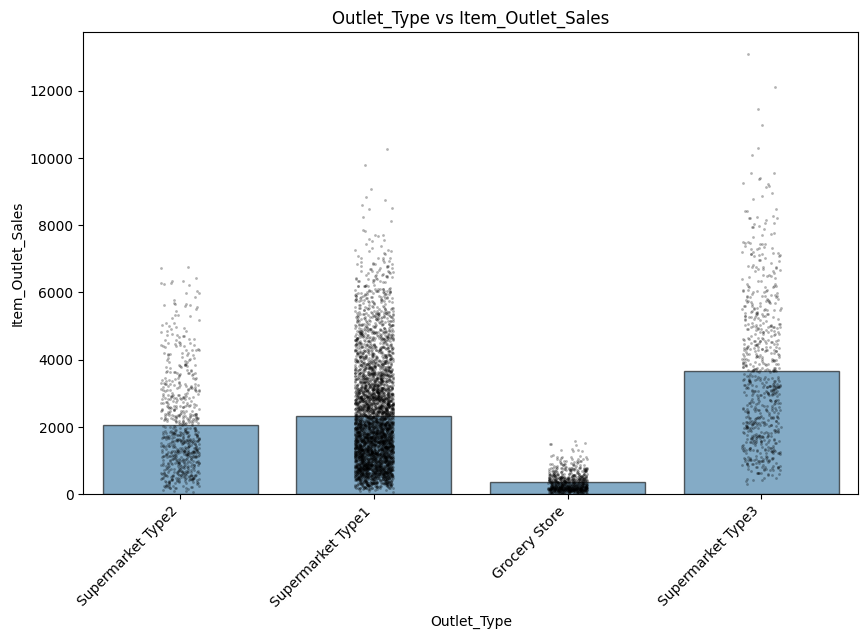
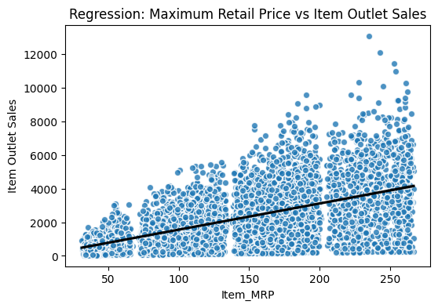
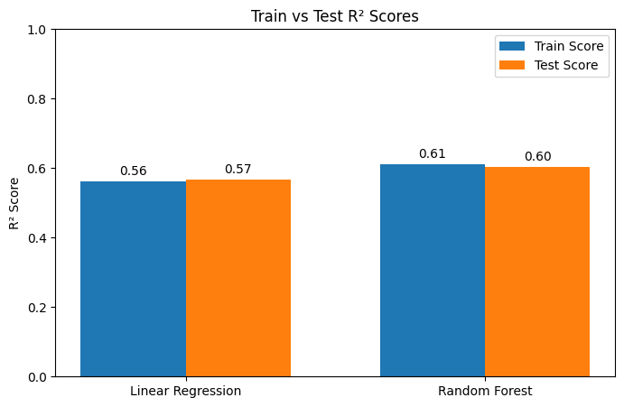
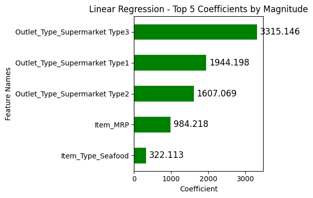
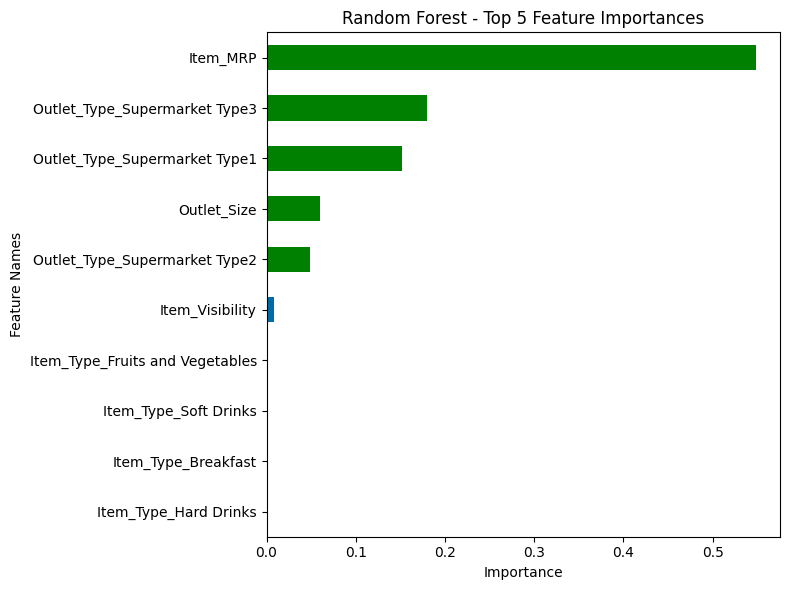

# Prediction of Product Sales

**Author**: Siwar Ehwass

### Business problem:
Outlets want to know what affects their sales so they can plan things like inventory and pricing better. This project tries to predict how much a product will sell at an Outlet, based on things like the product's MRP and the type of store. The goal is to help the business understand what factors matter most for sales.

### Data:
The dataset has past sales records for products sold at different stores. Each row shows one product's sales at one store, along with info about the product (like price) and the store (like its type and size).

## Methods
- Cleaned the data to fix missing or incorrect values, so the results are based on accurate information.
- Looked at how different features (like price and store type) relate to sales, to see which ones matter most.
- Built two models — Linear Regression and Random Forest — to predict sales, and compared them to see which one works better.
- Tested both models on data they hadn't seen before, to make sure they actually learned useful patterns instead of just memorizing the training data.

## Results

#### Visual 1: Outlet Type vs Item Outlet Sales

> Supermarket Type3 stores have the highest average sales by far, while Grocery Stores have the lowest. This shows that the type of store has a big effect on sales.

#### Visual 2: Maximum Retail Price vs Item Outlet Sales

> As an item's price goes up, its sales tend to go up too. This makes sense and shows that price is an important factor in predicting sales.

## Model
The final model chosen is a **Random Forest Regressor**, because it performed better than Linear Regression.

#### Visual 3: Train vs Test R² Scores

> Random Forest scored 0.60 on test data, compared to 0.57 for Linear Regression. Both models scored almost the same on training and test data, which means neither model is overfitting (memorizing instead of learning).

**Key results (Random Forest, Test Data):**
- R² = 0.602
- RMSE ≈ 1,047 sales units

This means the model can explain about 60% of why sales go up or down, using the info we have. On average, its predictions are off by about 1,047 sales units. So the model is a useful guide for planning, but it won't be exact every time.

#### Visual 4: Linear Regression - Top 5 Coefficients

> A closer look at just the 5 largest coefficients by magnitude.
>
> **Top 3 Most Impactful Features (Linear Regression)**
>
> 1. **`Outlet_Type_Supermarket Type3`** (+3,300) — Selling in a Supermarket Type3 store adds about 3,300 sales units compared to a Grocery Store. Biggest driver by far.
> 2. **`Outlet_Type_Supermarket Type1`** (+1,950) — Supermarket Type1 stores add about 1,950 sales units compared to a Grocery Store.
> 3. **`Outlet_Type_Supermarket Type2`** (+1,600) — Supermarket Type2 stores add about 1,600 sales units compared to a Grocery Store.
>
> **In simple words:** the type of store a product is sold in matters more than anything else in this model — more than price, product type, or fat content. Selling through a supermarket instead of a grocery store is the single best thing for sales.

#### Visual 5: Random Forest Feature Importances

> **Top 5 Most Important Features (Random Forest)**
>
> 1. **`Item_MRP`** (~0.55) — Price is by far the biggest factor. The model relies on this feature more than all others combined.
> 2. **`Outlet_Type_Supermarket Type3`** (~0.18) — Whether a product is sold in a Supermarket Type3 store matters a lot.
> 3. **`Outlet_Type_Supermarket Type1`** (~0.15) — Selling through a Supermarket Type1 store is also a strong signal.
> 4. **`Outlet_Size`** (~0.06) — The size of the store (Small, Medium, High) has a small but real effect.
> 5. **`Outlet_Type_Supermarket Type2`** (~0.05) — Supermarket Type2 stores add a little more predictive power.
>
> **In simple words:** price drives most of the prediction, and store type/size fill in the rest. Everything else — item category, fat content, visibility — barely matters to this model.

## Recommendations:
- Use the Random Forest model for sales predictions, since it works better than the simpler Linear Regression model.
- Pay attention to store type and item price, since both clearly affect sales — for example, bigger stores (Supermarket Type3) tend to sell a lot more.
- Treat the model's predictions as a helpful estimate, not a perfect answer, since it only explains about 60% of the differences in sales.

## Limitations & Next Steps
The model doesn't account for things like seasonality, promotions, or local demand, which could explain some of the sales it can't predict. Next steps could include adding more features (like time of year or marketing data), trying other models, and testing on newer data to make sure it still works well over time.

### For further information
For any additional questions, please contact **siwarehwass@gmail.com**
